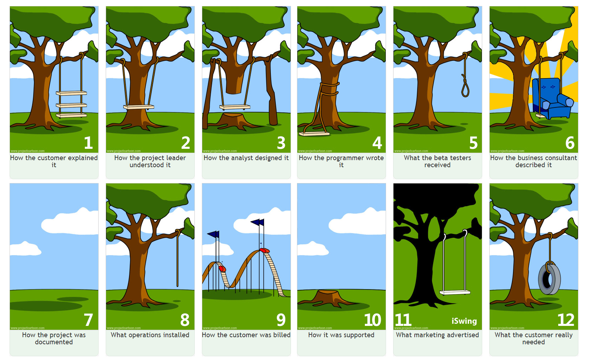

```{r setup, include=FALSE}
knitr::opts_chunk$set(echo = TRUE)
```

# Introduction
Reproducible research is one of the pillars of science. In the data science communities (statistics, machine learning, informatics, etc), repoducibility means that the exploration or analysis pipelines that you develop can be easily understood, employed, and possibly even improved upon by your peers. But first, my favourite visual explanation of software development teams:


We care about good collaborative development because we want to make our pipelines more *efficient*. However, efficiency has little to do with computational speed. **Efficient computing is *not* about making bad code run faster.** Why is this true? Human time is more valuable than computing time. Well-written code is easier to read and therefore easier to check for errors. Well-documented code is easier to use by other people. A well-organized and well-documented code pipeline is better to use than a "fast" pipeline almost every time. Efficiency is more about making you a better programmer, or enabling your team to work together more cohesively, than it is about fast code. 

Pipelines that can be easily understood (i.e. they require comparitively little human time to understand), are more *efficient* than pipelines that are just "fast". Of course this doesn't mean we don't try to make our code fast---faster code is better than slower code! However, I have found in many real-life scenarios that writing well-organized and properly documented code leads to that code being "faster" as a byproduct.

Throughout these notes, I will use verbage similar that necessary to describe a simple college essay discuss software projects as a whole. I consider these two tasks similar in the following respects: they both involve the expectations of a superior in how they are written and what they should accomplish; they both have clear rules for organization and formatting; and they both are meant to be shared with others. Here are some parallels I see between writing an essay and building a package / pipeline:

Writing                                Coding
----------------------------------     -----------------------------------
MS Word                                RStudio
Essay                                  Project / Pipeline
Paragraph                              Script
Sentence                               Command
Subjects, Verbs, and Objects           Inputs, Functions, and Outputs

Here are some resources that I have drawn from to write this material:

- Broman. "R Package Primer." <http://kbroman.org/pkg_primer/>
- Burns, 2011. *The R Inferno.* <http://www.burns-stat.com/pages/Tutor/R_inferno.pdf>
- Gillespie and Lovelace, 2016. *Efficient R Programming.* <https://bookdown.org/csgillespie/efficientR/>
- Ray, 2017. "How to Create a Project Management Plan." <https://www.projectmanager.com/blog/project-management-plan>
- Wickham. "The tidyverse Style Guide." <http://style.tidyverse.org/>
- Wrike, 2017. "Six Steps to a Foolproof Project Plan." <https://www.wrike.com/blog/foolproof-project-plan/>

The material I cover will be as follows. Collaboration-friendly pipelines start with a good outline, follow a common style guide, use version-control too keep track of changes, and have their development thoroughly documented. We will discuss collaborative, efficient pipeline development in this manner.


*******************************************************************************


</br>

# Project Outline
The key to developing a good project with others is a clear outline from the beginning. This outline must answer three key questions:

1. What is the desired result of the project?
2. What are the key initial conditions of the project?
3. What are the steps necessary to move from the initial conditions to the desired result?

These questions may seem rather basic, but most project issues arise from disagreements or unstated expectations in one of these three questions. Before any real design or development work is done, agreement from the entire development team on these three points is crucial.




## Outputs
To outline a project, we start backwards: what is our desired end result? That is, what should our pipeline deliver? In most instances, the result from a pipeline is a set of organized data (and, often, accompanying figures). Some examples include network graphs, time series plots of predicted cancer burden, tables of significance levels from a collection of linear models, or a website of tables and figures as supplemental material for a publication.

The details at this step are critical. I have found that encouraging the client or clinician to draw out the type of figures they would like to see can be very informative. This encourages all team members to discuss their "vision" for the project. Here is an example.

> For one project I worked on, the lead engineer wanted the pipeline to return four test statistics for a process every minute. The test statistics alone would have been a simple named vector. However, because the quality control team needed to compile the data at the end of each day, we used a data frame with one row and four columns to make compiling the results easier.

In the above example, what the lead client requested (passing a vector through the functions) would have been easier to code and computationally faster to execute. But, it would have missed what the client group *needed*. Detailed communication between all parties is absolutely critical in the design and outline phase of the project. Most problems with how the pipeline is received---and how much work you must put in to make everyone happy---are directly related to unmet expectations during this first phase.

## Inputs
After we have solidified the end result of the pipeline, we discuss the data, resources, and user input we have available to us. These include raw data files, expert opinion, web-hosted tables, servers and computing machinery, development time, consulting time, and even the opinions of the target audience. Each resource plays a different role in the project plan. Time constraints necessarily limit the scope of the project. Raw data, web data, and expert opinion inspire but provide boundaries for the type of questions the project can ask and answer. Increasing computational resources (and adding certain types of consulting expertise) will enable the developers to address more challenging questions or make the pipeline available to more users more often (through a dedicated server, for instance).

> For the same project addressed above, different measurements in the raw data were recorded at different temporal frequencies. On one hand, this motivated us to create temporal upscaling and downscaling functions for use on future projects. On the other hand, this work took time away from developing some enhancements to model the multivariate time series with matrix lags instead of simple vector lags.

As evidenced by the above example, there are always trade-offs in package / pipeline development. Time spent improving one area of the pipeline is time not spent improving another area. Ultimately, the project team must decide at the beginning what the *priorities* of the project are. 

## Middle Machinery
Once you have agreed on a specific end goal and the starting line in great detail, you can define the pieces in the middle. I have found that when the project isn't too complex, these tasks and the milestones that contain them (more or less) fall into place. This is where the "who's doing what" questions are asked and answered. I often recommend the team to draw out the pipeline from start to finish, with detailed stops along the way. Each stop in the pipeline is a new task to complete. For example, here is a data analysis pipeline that my team and I worked on recently:

1. Import the raw data files.
2. Transform and join the data into one object.
3. Analyze the object with one of three methods.
4. Organize the analysis output.
5. Graph and tabulate the results.

We started with sketches of the graphs and tables we wanted. Then, we discussed the resources we had available to us in order to set the scope of the project. Next, we wrote out the connective tissue from Step 1 to Step 5. Finally, we assigned different pieces of the pipeline to the team members. For instance, because Step 3 mentions three different methods, we could have assigned each method to a single developer for coding, documenting and testing. Because of the collaborative nature of these projects, I often recommend that each step be coded to work independently of the other steps. This makes testing, debugging, and enhancing the project much simpler.


*******************************************************************************


</br>

# Style Guides and Audience
Now that your team has a roadmap of the build process (a very basic project management plan), you need some "rules of the road". You, as a group, must decide on *how* the team will write and present code. For example, if you had planned to write a book with other people, you would first need to decide the style, language, and audience. Obviously, a book on cooking desserts written to schoolchildren in Korea would be written drastically differently from a book of dessert recipes to culinary students in France. The cookbook for Korean schoolchildren would be organized perhaps by color or party type, presented in English or Korean, and intended to keep the interest of an 11-year-old. The cookbook for French culinary students may be organized by main course or wine selection pairings, certainly written in French, and intended to be a procedural reference manual.

When you write a code pipeline, you must keep these questions in mind---especially if you want your colleagues to be able to contribute meaningful content. You have to agree on how data, functions, and reference material should be organized. You have to agree on naming files, functions, data sets, and variables. These are all the topics of *coding style guides*.  When all developers on a project agree to these rules, it makes a single person's code much easier to follow for everyone else.

Here is a link to Google's **R Style Guide**: <https://google.github.io/styleguide/Rguide.xml>; and this a link to the RStudio IDE [cheat sheet](https://www.rstudio.com/wp-content/uploads/2016/01/rstudio-IDE-cheatsheet.pdf), which has a lot of style-guide functionality built in. I've summarized some of the main points of the Google Style Guide, supplemented with the "Analysis" half of Wickham's guide, and added my thoughts where appropriate.


## Naming Things

> There are only two hard things in Computer Science: cache invalidation and naming things.
-- Phil Karlton

Some main points are:

1. **File names end in ".R".** This rule is more for the MacOS and Linux users. In Windows, most of the files will be given the correct extension automatically. However, you should still check that your files use these rules:
    a. Scripts end in ".R".
    b. Testing scripts should have the same name as the file tested, but with the "_test.R" suffix instead of just ".R".
    c. Data files should end in ".RData", ".rda" (from legacy code), or ".rds". Pick one and stick with it.
    d. Foreign scripts (from C++, JavaScript, etc) should use their native file extensions. For instance, C++ scripts should end with ".cpp" or ".C", JavScript scripts end in ".js", FORTRAN 95 scripts end in ".f95", etc., etc., etc.
    e. LaTeX documents should end in ".tex".
    f. RMarkdown and Markdown documents should end in ".Rmd" or ".md", respectively.
    g. Ordered files in a pipeline should have leading numbers (`00_file_name`, `01_different_file_name`, ...) to keep presentation orderly.
2. **Use `lowerCamelCase` or `lower_snake_case` for object names. Use `UpperCamelCase` for function names.** While the Google Style Guide recommends `period.case`, I *strongly* disagree with this, due to the inherent method dispatch functionality for S3 classed-objects in R (`method.class` function names). My preference is to use lower camel case of nouns with a class subscript (`lgl`, `num`, `fct`, `char`, `mat`, `df`, `ls`, etc.) for objects, and upper camel case with a leading verb for functions. Examples:
    a. a matrix of patient blood sugar levels over time (when I already have a static blood sugar measurement): `bloodSugarXTime_mat`. 
    b. a character vector of patient last names: `surname_char`.
    c. a list of OLS summaries: `lmSummaries_ls`.
    d. a function to transpose a high-dimensional data frame: `TransposeDF`.
3. Once again, **objects are named with nouns, functions are named with verbs.**
4. **Do not use the `attach()` function.** This function makes components from data frames or lists and makes them available to R directly through their names. This can cause serious problems when you have other objects with the same name (especially if you attach an object created by someone who uses the same naming convention as you). There really isn't any *need* for the `attach` function, so just don't use it.


## General Formatting
Just like essays have certain rules (indent the first line of a paragraph, single / double space after periods, etc.), code scripts also have rules.

1. **Lines contain 80 characters maximum.** This rule is rather archaic---it comes from when computers used punch cards---but still serves a purpose today. Different people have different size computer monitors, and lines that are 80 characters wide can easily be displayed on all sorts of screens. Also, 80-character lines fit on a printed page or in vignette PDFs very well. This rule serves another purpose: if your lines are consistently over 80 characters, this is a signal to you that you need to make your code simpler.
2. **Use two spaces (no tabs) for indentation.** If you ever decide to release a package, then spacing becomes important for R documentation and meta-data files. It's good to get into the habit of using the "two-space" indentation rule in any case; also, the RStudio IDE does this for you automatically most of the time.
3. **Pad all operator calls with single spaces.** Similar to the "80 characters wide" rule, this rule has no bearing on how the code executes, but makes a world of difference to human readibility. An exception is commas: commas have one space after but no space before. Overall, don'tmakecodehardertoreadthanithastobe, and GIVE YOUR CODE SOME SPACE. Examples:
    a. `randErr_num <- rnorm(25, sd = 0.1)` instead of `randErr_num<-rnorm(25,sd=0.1)`.
    b. `loss <- 3` or `loss < -3` instead of `loss<-3`.
    c. `if (check) {` instead of `if(check){`
4. **Use curly braces properly, especially surrounding an `else` statement.** Curly braces should open on the line that calls them, and close on their own last line, except in the case of an `else`. When curly braces enclose multiple lines of code, add blank lines after the opening and before the closing. Here are some examples:
    ```
    DoSomething <- function(x){
    
      lines and lines and
      lines and lines and
      lines and lines
      of stuff
      
    }
    ```
    ```
    if (something_lgl) {
      do(x)
    } else {
      do(y)
    }
    ```
5. Minutiae: **Use ` <- ` for assignment, not ` = `. Do not end lines with `;`. Use double quotes instead of single quotes.**
6. **Assign tasks with `# TODO(person's name)`.** Always use the exact same character string style to mark tasks. This makes it quite simple for a person to search the directory for all outstanding build, bug, documentation, or enhancement requests. (GitHub is [good for this](https://help.github.com/articles/assigning-issues-and-pull-requests-to-other-github-users/) too.) On Windows, search an entire RStudio project directory via `Ctrl + Shift + F` (`Cmd + Shift + F` for MacOS).
7. **Organize your scripts with code chunks.** Use comments to describe the sections of your scripts. Remember, comments are to tell *why* you wrote the code the way that you did; comments should never "parrot"  the code. When you have a large script, break it into pieces by
```
######  New Code Section  #####################################################
# A new code section in an R script is created with six pound signs (#), two
#   spaces, the section description, two more spaces, and pound signs until the
#   80th character slot is reached.
```

## Functions
Because R is a functional language, the functions you write should be the most important pieces of your code. Functions in R, through their inherent vectorized efficiency, turn this
```
lsum <- 0
for (i in 1:length(x)) {
  lsum <- lsum + log(x[i])
}
```
into this
```
lsum <- sum(log(x))
```
(This and other mortal R sins are covered in [The R Inferno](http://www.burns-stat.com/documents/books/the-r-inferno/).) R is a *functional* programming language, so you must *learn to use functions* in your code. Furthermore, while this isn't required, you should probably think about collecting the functions you write into a package. Here are some guidelines on writing functions:

1. **Functions should do one major thing, only that thing, and that thing well.** A function that does a million things is easy to break and horribly difficult to test. Keep your functions simple, and you will not regret it.
2. **Major functions should be saved in their own script files.** This is crucial for packages, as unit tests should be exactly that---testing a single *unit* of code. Also, this will allow multiple people to work on their individual pieces of the package without constantly merging the results into one giant functions file. Overall, this encourages your project code to be compartmentalized and organized. For non-package projects, this is still *very important* for testing and organization, but it's not necessarily critical. Overall, I *strongly* recommend you do not store all of your functions in one file. If you have a ton of functions to source all at once, create a package. Even if you never plan to release the code to anyone outside your group, *create a package anyway*.
3. **Utility functions can be collected into one file.** Because you probably do not need extensive documentation of utility functions, you can store all related utility functions together.

### Indendations and New Lines
When you call a function, move argument name-value pairs to new lines when and where appropriate, aligned with the first argument. Do NOT split a name-value pair. Here are some examples:
```
# Good
output <- SomeFunction(arg1 = x, arg2 = y, simplify = FALSE)
# Good
output <- SomeFunction(arg1 = x, arg2 = y,
                       simplify = FALSE)
# Bad
output <- SomeFunction(arg1 = x, arg2 = y, simplify =
                       FALSE)
```

For arguments or functions with very long names, put each argument on an indented new line.
```
# Good
output <- SomeReallyReallyLongFunctionNameWithLongArguments(
  longArgumentName1 = x,
  longArgumentName2 = y,
  arg3 = z
)
# Bad
output <- SomeReallyReallyLongFunctionNameWithLongArguments(longArgumentName1 = x,
                                                            longArgumentName2 = y,
                                                            arg3 = z)
```
Most of the time, these long argument names or long function names would put your code over the 80-character line-width limit, so pushing the argument to a new line makes the code easier to read and print.

### Documenting your Functions
Code comments are the glue that hold a collaboration team together across time and space. You write comments to three people: yourself today, yourself in six months, and people who have never seen your code. These comments will include:

1. the function name and description,
2. names and descriptions for each argument to the function,
3. a description of what the function returns,
4. a thorough commentary on how the function works,
5. at least one working example, and
6. citation, external links, internal links, etc. all as appropriate.

Comments *always* have a single space between the comment character (`#`, `#'`, or `%`---depending on the language) and the start of the comment.

#### Roxygen Comments
When your functions belong to a package, use [roxygen comments](https://cran.r-project.org/web/packages/roxygen2/vignettes/rd.html) to document them. 

Here is an example of roxygen comments for a particular function:
```
#' Display the Summary of a \code{pathwaySet}-class Object.
#'
#' @description The display method for pathways lists as returned by the
#'    \code{\link{read_gmt}} function.
#'
#' @param x An object of class \code{pathwaySet}.
#' @param ... Lazy dots for additional internal arguments (currently unused).
#'
#' @return \code{x}, returned invisibly (with the \code{\link{invisible}}
#'    function).
#'
#' @details This function sets a \code{print} method for \code{pathwaySet}
#'    objects.
#'
#' @export
#'
#' @seealso \code{\link{read_gmt}}
#'
#' @importFrom utils str
#'
#' @examples
#'   ###  Load the Example Data  ###
#'   data("colon_pathwaySet")
#'
#'   ###  Print / Show  ###
#'   colon_pathwaySet
#'
print.pathwaySet <- function(x, ...){

  classes_char <- class(x)
  cat("Object with Class(es) '",
      paste(classes_char, collapse = "', '"),
      "' [package 'pathwayPCA'] with ",
      length(x), " elements: \n",
      sep = "")
  str(x,
      max.level = 1,
      vec.len = 1,
      give.attr = FALSE,
      no.list = TRUE)

}
```

#### Vanilla Comments
When your functions are *not* saved within a package, add these same comments as the first lines within your function. The information you include will be quite similar, however. This ensures that the comments *about* the function always travel *with* the function.
```
CalculateSampleCovariance <- function(x, y, verbose = TRUE) {
  # Computes the sample covariance between two vectors.
  #
  # Args:
  #   x: One of two vectors whose sample covariance is to be calculated.
  #   y: The other vector. x and y must have the same length, greater than one,
  #      with no missing values.
  #   verbose: If TRUE, prints sample covariance; if not, not. Default is TRUE.
  #
  # Returns:
  #   The sample covariance between x and y.
  # 
  # Example:
  # CalculateSampleCovariance(x = rnorm(10), y = rnorm(10))
  
  
  n <- length(x)
  # Error handling
  if (n <= 1 || n != length(y)) {
    stop("Arguments x and y have different lengths: ",
         length(x), " and ", length(y), ".")
  }
  if (TRUE %in% is.na(x) || TRUE %in% is.na(y)) {
    stop(" Arguments x and y must not have missing values.")
  }
  covariance <- var(x, y)
  if (verbose)
    cat("Covariance = ", round(covariance, 4), ".\n", sep = "")
  return(covariance)
}
```

## Piping Functions
When writing scripts, I strongly recommend the use of the ` %>% ` (pipe) operator (from the [magrittr](https://magrittr.tidyverse.org/articles/magrittr.html) package---included in `dplyr` and the `tidyverse`). Pipe operators turn
\[
f(g(h(j(k(y, e), d), c), b), a)
\]
into
\[
y \mapsto k(.,e) \mapsto j(.,d) \mapsto h(.,c) \mapsto g(.,b) \mapsto f(.,a),
\]
which is considerably easier to follow. Consider the following code (from a nice DataCamp [tutorial](https://www.datacamp.com/community/tutorials/pipe-r-tutorial)), before and after the use of the pipe operator:
```
# Before
sum(select(filter(babynames,sex=="M",name=="Taylor"),n))

round(exp(diff(log(x))), 1)

# After
babynames %>%
  filter(sex == "M", name == "Taylor") %>%
  select(n) %>%
  sum
  
x %>%
  log() %>%
  diff() %>%
  exp() %>%
  round(1)
```
The pipe operator makes chained or nested code much easier to read. However, this clarity comes with a drawback: the pipe operator uses [non-standard evaluation](http://adv-r.had.co.nz/Computing-on-the-language.html), which means that *development* with the pipe operator [can be more challenging](https://bookdown.org/rdpeng/RProgDA/non-standard-evaluation.html). However, do not let this discourage you from using the pipe operator in your scripts.


## Intended Users
Now that we have an outline and some rules to follow, we need to discuss the project audience. If you ever want to feel frustrated, try to find *all* the textbooks on [Principal Components Analysis](https://en.wikipedia.org/wiki/Principal_component_analysis). Why would this be hard, you may ask? Because it has a different name within each scientific field that uses it. Wikipedia lists 14 (*fourteen!*) different names for the technique based on the field that uses it. What does this tell us? The audience of a software project informs the nomenclature of the project: always keep the intended user in the back of your mind as you write code.

Function names should be intuitive to the targets audience of your pipeline. The same goes for object names, and even the package name itself (if applicable). Function examples should flow from common questions asked in the target users' field of study. If the pipeline is intended to be general, then you should include many interdisciplinary examples with your function and pipeline documentation. Whenever possible, have an expert in the specified field (who isn't software-trained) try to read your documentation and help files. If the intended user cannot understand *how* to use your pipeline, then it doesn't matter how fast it is. All your hard work will have been a waste, unless you can translate the names and examples in your pipeline into the a language easily understood by your intended user.

*******************************************************************************


</br>

# Conclusion
We will wrap up this material in the second lectcure on version control with GitHub and proper project documentation.