```{r setup, include=FALSE}
knitr::opts_chunk$set(echo = TRUE)
```

# Introduction


## Why packages?
Packages are great ways to organize your code and share it with other people. Packages start with as few as two functions. From [Jeff Leek's](https://twitter.com/jtleek) [package development notes](https://github.com/jtleek/rpackages), these are a few succinct reasons to think in packages:

1. Well-documented and well-organized software can have a strong, positive impact on science methodology (and *reproducibility*) as a whole.
2. People remember the software packages they use a lot more than some of the papers they are based upon.
3. Personal packages are the epitome of good code organization.

Our motivation will be a set of utility functions. We will write two functions: one to transpose a data frame, and another function to "add" strings together. We will then document our utility package and install it for future use.


## Supplemental material
Here are the books / websites from which I shamelessly steal my material:

0. `devtools` package [cheat sheet](https://www.rstudio.com/wp-content/uploads/2015/03/devtools-cheatsheet.pdf)
1. Beginner: Dr. Hillary Parker's [blog](https://hilaryparker.com/2014/04/29/writing-an-r-package-from-scratch/).
2. Intermediate: Dr. F. C. Chan's [blog](http://tinyheero.github.io/jekyll/update/2015/07/26/making-your-first-R-package.html).
3. Advanced: Dr. Karl Broman's [package tutorial](http://kbroman.org/pkg_primer/).
4. Expert: Dr. Hadley Wickham's [R Packages book](http://r-pkgs.had.co.nz/).
5. You are one of the Old Gods of `R` (Bill Venables or Brian Ripley): [click here](mailto:r-help@R-project.org).


## Installing the necessary tools
```{r devtoolsInstall, eval = FALSE}
install.packages("devtools")
library(devtools)

install.packages("roxygen2")
library(roxygen2)
```

If you do not have a development tools suite on your computer, download one. You will need a developer kit to install packages that need compilation. If you don't know what this means, don't worry too much about it for the time being.

* For Mac, install [Xcode](https://developer.apple.com/download/).
* For Windows, install [Rtools](http://cran.us.r-project.org/bin/windows/Rtools/).
* For Linux, install the R development package (`r-devel` or `r-base-dev`) and ask someone else for help (I'm not particularly versed in Linux...)

Now you can install packages from [bitbucket](https://bitbucket.org/), an [svn](https://subversion.apache.org/) server, [GitHub](https://github.com/), or elsewhere on [the Internet](https://www.youtube.com/watch?v=dQw4w9WgXcQ).

*******************************************************************************


</br>

# Directory and Package Setup

## Create the package directory
We will start by creating a directory for our utility functions. Within my "Documents/" folder, I have a directory just for software projects called "GitHub". *It is vitally important that you **do not** save your packages in a synced directory (such as a Dropbox or Box Sync folder).* This will cause you nothing but pain and suffering down the road. We will talk later about a tool specifically designed to "sync" code projects from your computer to the cloud and back.

This is where I will create the "myUtilities" package. You can see from my screen shots that I'm working on a Windows machine at the moment. From personal experience, there are little---if any---differences between setting up a new package on Windows or Mac. If you have questions while setting up a new package on Mac, just let me know.

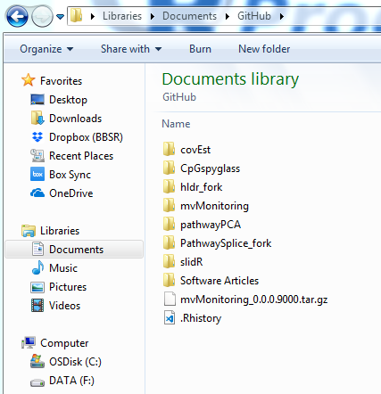

First, in `R`, I change my [working directory](http://rprogramming.net/set-working-directory-in-r/) to the "GitHub" parent directory.
```{r packageDir, eval = FALSE}
setwd("C:/Users/gjo15/Documents/GitHub")
```

Now that I'm in my parent directory, I can use the `create()` function from the `devtools` package to create my utilities package.
```{r createPackage, eval = FALSE}
devtools::create("myUtilities")
```

Now I see that I have a folder called "myUtilities" in my "GitHub" code projects directory:

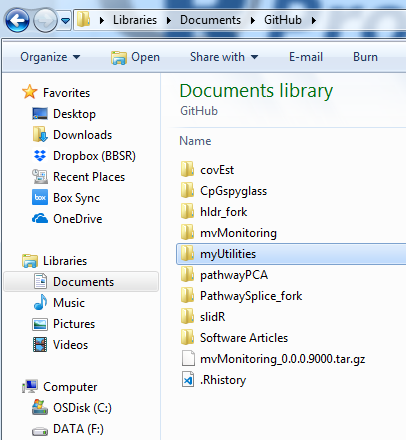


## Contents of the package directory
When I look inside the "myUtilities/" directory, this is what I see:

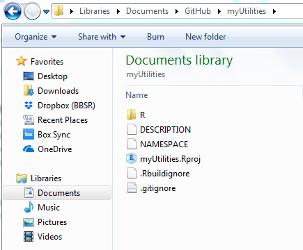

Of these new files, there are only three that are *required* for a package: the DESCRIPTION file, NAMESPACE file, and R/ scripts directory. However, we will first talk about a fourth: the Rstudio Project file.

### The RStudio project file
I will double-click to open the "myUtilities.Rproj" file. This opens an RStudio *integrated development environment* (IDE) window with my new package as the working directory. Notice that the top-right corner of the IDE says that I am currently working on the project "myUtilities".

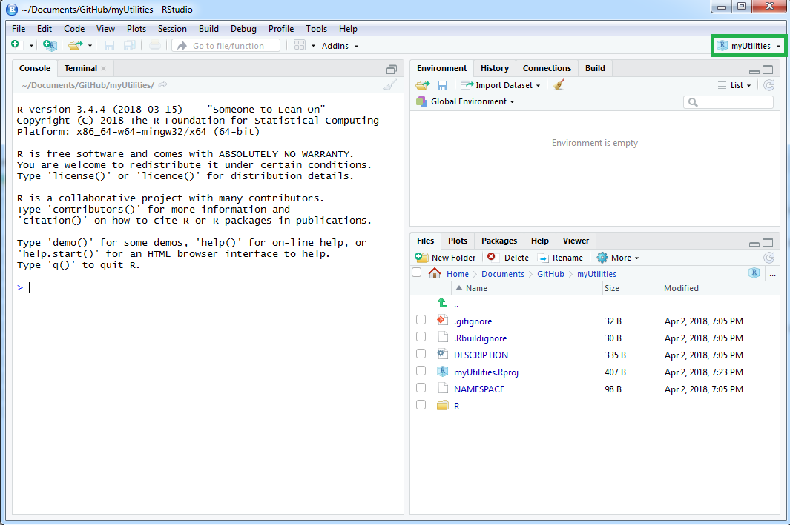

This file keeps track of my development preferences and remembers which files I was working on when I last took a break. It's not required to use the ".Rproj" file (and the package will be completely fine without it), but it can be very helpful for your work.

### The DESCRIPTION file
I double-click on the DESCRIPTION file, and the "Editor" pane opens in RStudio. 

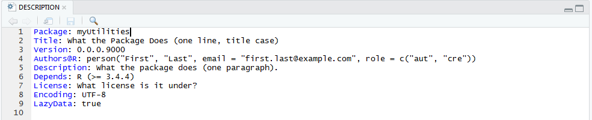

This file is where the "meta-data" for your package is written. For packages that you never plan to share with other people, some parts of this file aren't all that important. However, as soon as you try to make your package available to others (through official repositories such as CRAN or Bioconductor, or unnoficially through GitHub), the DESCRIPTION file is how you tell the world who you are, how to contact you, and what they should or shouldn't do with your package. It has very specific formatting rules which we will see in action later. For a more in-depth discussion, see Hadley's [package metadata](http://r-pkgs.had.co.nz/description.html) chapter.

### The R/ directory

This directory doesn't currently have any files in it, but this is where we will put all of our functions (and their documenting comments). Other than a few exceptions, **each function should be saved in its own file**. The files should be named close to (if not identical to) the name of the function within it. One exception would be a collection of small functions that are all somehow related (the arithmetic operators in `R` are a good example). Another exception would be a suite of functions with nearly identical inputs and / or outputs that perform similar tasks (for instance `dnorm`, `pnorm`, `qnorm`, and `rnorm`: the Normal Distribution family of functions).

### The NAMESPACE file

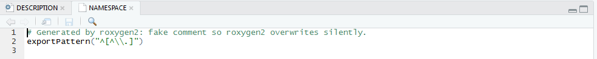

Right now, we don't have a whole lot going on in this file, but the NAMESPACE is the file to tell `R` how your package should interact with other packages. Because so many development issues arise from an improperly-formatted NAMESPACE, we will not edit ours by hand. We will use the [`roxygen2` package](https://cran.r-project.org/web/packages/roxygen2/vignettes/namespace.html) to manage our NAMESPACE for us.

*******************************************************************************


</br>

# Write your Functions
Now that we know what toys are in our sandbox, it's time to build our very first function. Go to `File > New File > R Script` or press `CTRL/CMD + Shift + N` to create a new script to hold your function and start typing away!

## Our first function
The first function I'd like to build will transpose a data frame while preserving the row and column names.

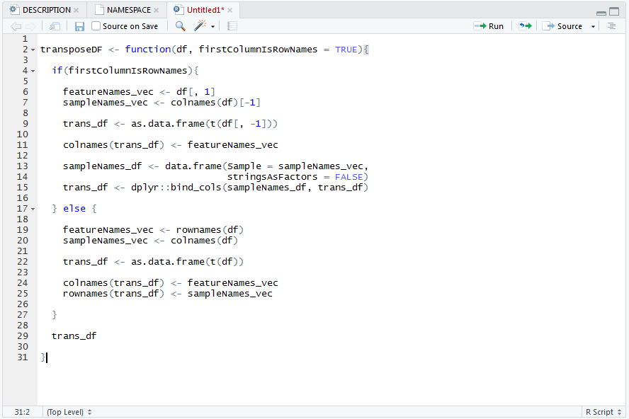

We have written the first function in our package. I will save this function in its own R script file, which I will call `"transposeDF.R"`.


## An aside on function testing
This is where I am not the best code developer. Off to the side, I will write informal tests of my new `transposeDF` function. While testing this function, I found two mistakes that I had made (so you are seeing this function after it has already passed a first round of tests). Honestly, this isn't the best way: I should be using the [`testthat` package](https://journal.r-project.org/archive/2011/RJ-2011-002/RJ-2011-002.pdf) to formalize and automate my tests instead, and I should be writing formal function tests in the `tests/` directory, but I haven't spent the time to learn how to automate my package testing. Don't be like me: *take the time to learn how to write proper and automated function testing*.


## Our second function
I recently saw that Python allows you to use the "+" operator to "add" (concatenate) strings together. This seems pretty cool, so let's update the plus sign in R. I'm going to save this new function in the file `"pythonAdd.R"`.

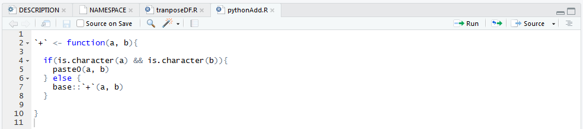

 Here is what my `R/` directory looks like now:

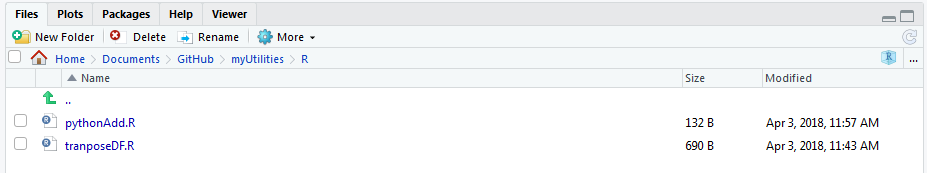

*******************************************************************************


</br>

# Document
We now have two lovely functions in our package, but we can't use the package yet---we need to document these functions first. Documentation is written to three different people: yourself today, yourself in six months, and your collaborator. Documentation includes building `.Rd` files in a `man/` directory and updating our `NAMESSPACE`. Thankfully, we don't have to do this manually.

## The `roxygen` documentation skeleton
I want to write some help documentation on my data frame transposition function, so I will insert a *documentation skeleton*. This can be accomplished by opening the R script you want to document, moving the cursor inside the function you will document, and pressing `CTRL/CMD + Alt + Shift + R`. This inserts a `roxygen` skeleton that looks like this:

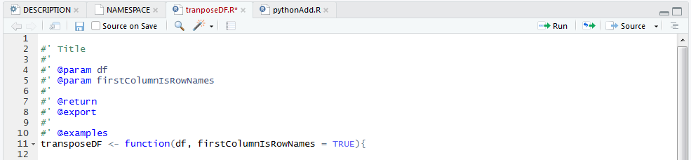


## `roxygen` syntax
Here are a few brief points about the [documentation syntax](http://kbroman.org/pkg_primer/pages/docs.html):

1. Each line of a `roxygen` comment begins with `#'`. This tells `R` to process whatever text that follows this symbol as R Documentation. 
2. Fields in documentation have markers. These markers all begin with the `@` symbol and no spaces. This is how R knows what words go where in the help files.
3. Function parameters are documented with `@params <NAME> <DESCRIPTION>`. `roxygen` fills in the `<NAME>` field for us, but we need to describe what that parameter is.
4. If you want your amazing new function to be available to anyone who can load your package (with `library(myUtilities)` for instance), then **you must export your function** with the `@export` tag. This tells `R` to add this function to your package `NAMESPACE` file. Otherwise, all your hard work will be hidden.


## Documented `transposeDF` function
Here is what the finished documentation might look like for the `transposeDF` function:

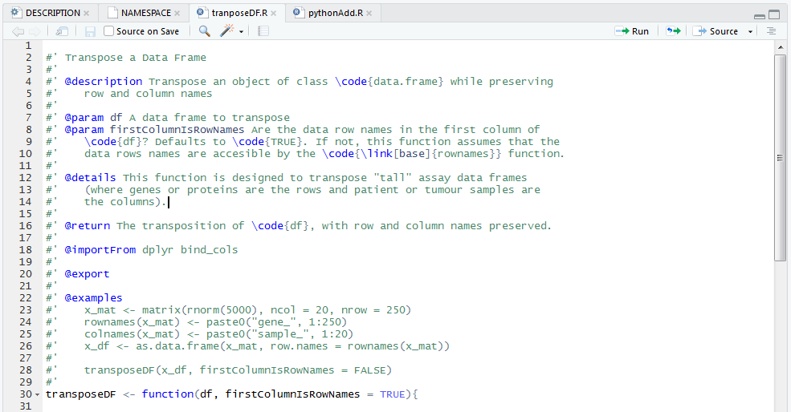

Notice a few points:

1. I have to use special text formatting commands within `R` documentation sections. These commands are similar to commands from the typesetting language [LaTeX](https://www.latex-project.org/), but you don't need to know LaTeX to write R documentation. A simple list of formatting commands can be found [here](https://cran.r-project.org/web/packages/roxygen2/vignettes/formatting.html). It may look scary at first, but it honestly isn't that bad.
2. The `@description` field should be a single (short) sentence explaining what the function does in brief. The `@details` field is where you describe the function is as much detail as you want. Paragraphs are seperated by blank lines and should follow the same level of indent.
3. If a function argument has a default value, include it in the description of that argument.
4. We are "borrowing" the `bind_cols` function from the `dplyr` package. In order to do this properly, I include that specific function in the `@importFrom` field. This tells `R` that any time I use the `bind_cols` function, I want the `dplyr` version. Also, this function will be added to the package `NAMESPACE` automatically. **Never use `library()` or `require()` in a package.**


## Compiling documentation
While we have saved our work in the `R/` directory, you may notice that `?transposeDF` doesn't work. For some reason, `R` can't find our help files that we wrote. We should compile them. We will build our `.Rd` files with the `document` function.
```{r buildDocumentation, eval = FALSE}
devtools::document()
```
```
Updating myUtilities documentation
Loading myUtilities
Updating roxygen version in C:\Users\gjo15\Documents\GitHub\myUtilities/DESCRIPTION
Writing NAMESPACE
Writing plus.Rd
Writing transposeDF.Rd
```

It looks like the `document` function made quite a few changes:

1. We now have a `man/` directory in our package. 

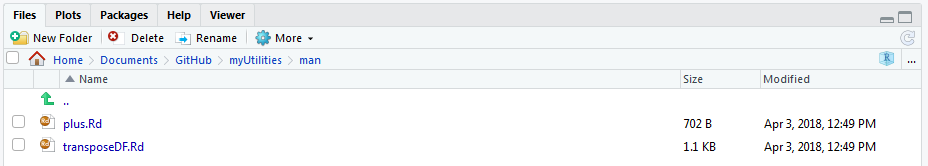

2. We have `.Rd` files for both of our functions. Notice that there is a warning at the top of the `.Rd` file to not edit it by hand. This is because we wrote the documentation already in the `transposeDF.R` script. It is good practice to let `roxygen` do the heavy lifting for the documentation. **Do not edit the files in the `man/` directory. Edit them in your `roxygen` comment fields.**

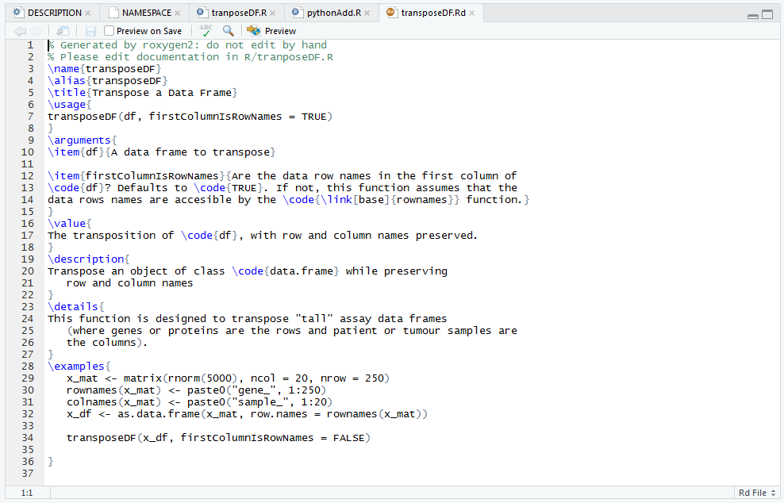

3. The documentation files are named after the function names, not the script names (so our new `+` function is documented in `plus.Rd`).
4. The line `RoxygenNote: 6.0.1` is added as the last line of the `DESCRIPTION` file.
5. The `NAMESPACE` has been written over. Once again, this is written automatically from your `roxygen` documentation. **Do not edit it yourself.** We see that our two functions are exported for anyone who can load the package to use. Also, we see that the `NAMESPACE` file is telling `R` that we need to use the `bind_cols` function from the `dplyr` library.

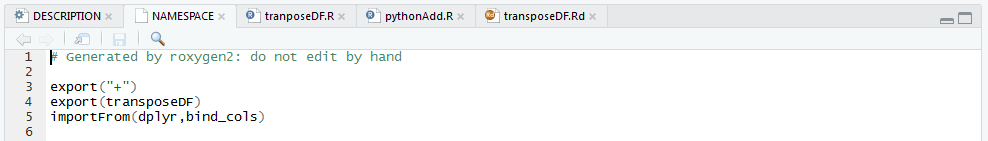

*******************************************************************************


</br>

# Build and Install

## First install
Up to this point, all of our work and documentation is available *within our current `R` session*. However, if we want our work to be available any time we use `R`, we need to install our package. We do this with the `install` function. (Make sure you are in your package directory (use `getwd()` to make sure) before you install your package.)
```{r eval = FALSE}
getwd()
```
```
"C:/Users/gjo15/Documents/GitHub/myUtilities"
```
```{r installPackage, eval = FALSE}
devtools::install()
```
```
Installing myUtilities
"C:/PROGRA~1/R/R-34~1.4/bin/x64/R" --no-site-file --no-environ --no-save --no-restore --quiet CMD INSTALL  \
  "C:/Users/gjo15/Documents/GitHub/myUtilities" --library="C:/Program Files/R/R-3.4.4/library" --install-tests 

* installing *source* package 'myUtilities' ...
** R
** preparing package for lazy loading
** help
*** installing help indices
  converting help for package 'myUtilities'
    finding HTML links ... done
    plus                                    html  
    transposeDF                             html  
** building package indices
** testing if installed package can be loaded
* DONE (myUtilities)
In R CMD INSTALL
```

Now, we can restart our session---or even switch to an entirely different project, and load the package. Our package edits the `+` operator from the `base` package, so `R` prints a message informing us.
```{r loadPackage, eval = FALSE}
library(myUtilities)
```
```
Attaching package: ‘myUtilities’

The following object is masked from ‘package:base’:

    +
```


## Check the package
To make sure we haven't made any syntax mistakes, we will use the `check` function. This function will *not* check that your functions do what you *expect* them to do---that's the job of proper testing scripts using the `testthat` package. However, the `check` function will test your package for missing objects, functions called from other packages that aren't in your `NAMESPACE`, and a whole host of best coding practices. The `check` function returns a list of `ERRORs`, `WARNINGs`, and `NOTEs` (in order of severity). For your package to work at all, you must fix all `ERRORs`. For your package to work properly, you must remove all `WARNINGs`. For your package to be hosted on CRAN or Bioconductor, you must have as few `NOTEs` as possible---ideally 0. Also, because the `check` function looks at files *and* functions, this is another reason to have your functions saved in script files with informative and congruent names.
```{r checkPackage, eval = FALSE}
devtools::check()
```
```
Updating myUtilities documentation
Loading myUtilities
Setting env vars -------------------------------------------------------------------------------------------------
CFLAGS  : -Wall -pedantic
CXXFLAGS: -Wall -pedantic
Building myUtilities ---------------------------------------------------------------------------------------------
"C:/PROGRA~1/R/R-34~1.4/bin/x64/R" --no-site-file --no-environ --no-save --no-restore --quiet CMD build  \
  "C:\Users\gjo15\Documents\GitHub\myUtilities" --no-resave-data --no-manual 

* checking for file 'C:\Users\gjo15\Documents\GitHub\myUtilities/DESCRIPTION' ... OK
* preparing 'myUtilities':
* checking DESCRIPTION meta-information ... OK
* checking for LF line-endings in source and make files and shell scripts
* checking for empty or unneeded directories
* building 'myUtilities_0.0.0.9000.tar.gz'

Setting env vars -------------------------------------------------------------------------------------------------
_R_CHECK_CRAN_INCOMING_ : FALSE
_R_CHECK_FORCE_SUGGESTS_: FALSE
Checking myUtilities ---------------------------------------------------------------------------------------------
"C:/PROGRA~1/R/R-34~1.4/bin/x64/R" --no-site-file --no-environ --no-save --no-restore --quiet CMD check  \
  "C:\Users\gjo15\AppData\Local\Temp\Rtmp63un4F/myUtilities_0.0.0.9000.tar.gz" --as-cran --timings --no-manual 

* using log directory 'C:/Users/gjo15/AppData/Local/Temp/Rtmp63un4F/myUtilities.Rcheck'
* using R version 3.4.4 (2018-03-15)
* using platform: x86_64-w64-mingw32 (64-bit)
* using session charset: ISO8859-1
* using options '--no-manual --as-cran'
* checking for file 'myUtilities/DESCRIPTION' ... OK
* this is package 'myUtilities' version '0.0.0.9000'
* package encoding: UTF-8
* checking package namespace information ... OK
* checking package dependencies ... ERROR
Namespace dependency not required: 'dplyr'

See section 'The DESCRIPTION file' in the 'Writing R Extensions'
manual.
* DONE

Status: 1 ERROR
See
  'C:/Users/gjo15/AppData/Local/Temp/Rtmp63un4F/myUtilities.Rcheck/00check.log'
for details.

R CMD check results
1 error  | 0 warnings | 0 notes
checking package dependencies ... ERROR
Namespace dependency not required: 'dplyr'

See section 'The DESCRIPTION file' in the 'Writing R Extensions'
manual.
```

Well, apparently I made a mistake: I have the package `dplyr` listed in the `NAMESPACE` file, but I forgot to add it to the `DESCRIPTION` file. 

### Fix the DESCRIPTION error
I'll add the package `dplyr` to the `DESCRIPTION` file. I will add this package to the `Imports:` field. Any other packages that are listed in the `NAMESPACE` file should be added to the `Imports:` field in alphabetical order, seperated by commas. Once again, for a more in-depth discussion, see Hadley's [package metadata](http://r-pkgs.had.co.nz/description.html) chapter. Also note the `RoxygenNote` field; that was added automatically when we first ran the `document` function on our package.

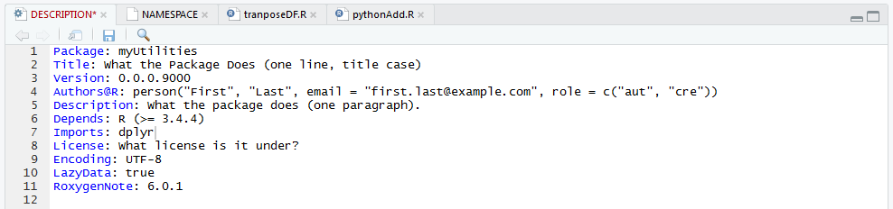


### Re-check the package
The `check` function will run through a litany of tests until it encounters the first error. Because this `ERROR` pertained to the *package dependencies*, the `check` function only completed its third checklist item. As you might imagine, this is an iterative process: check the package, fix the error, re-check the package, fix the next error, and so on...
```{r checkPackage2, eval = FALSE}
devtools::check()
```
```
Updating myUtilities documentation
Loading myUtilities
Setting env vars -------------------------------------------------------------------------------------------------
CFLAGS  : -Wall -pedantic
CXXFLAGS: -Wall -pedantic
Building myUtilities ---------------------------------------------------------------------------------------------
"C:/PROGRA~1/R/R-34~1.4/bin/x64/R" --no-site-file --no-environ --no-save --no-restore --quiet CMD build  \
  "C:\Users\gjo15\Documents\GitHub\myUtilities" --no-resave-data --no-manual 

* checking for file 'C:\Users\gjo15\Documents\GitHub\myUtilities/DESCRIPTION' ... OK
* preparing 'myUtilities':
* checking DESCRIPTION meta-information ... OK
* checking for LF line-endings in source and make files and shell scripts
* checking for empty or unneeded directories
* building 'myUtilities_0.0.0.9000.tar.gz'

Setting env vars -------------------------------------------------------------------------------------------------
_R_CHECK_CRAN_INCOMING_ : FALSE
_R_CHECK_FORCE_SUGGESTS_: FALSE
Checking myUtilities ---------------------------------------------------------------------------------------------
"C:/PROGRA~1/R/R-34~1.4/bin/x64/R" --no-site-file --no-environ --no-save --no-restore --quiet CMD check  \
  "C:\Users\gjo15\AppData\Local\Temp\Rtmp63un4F/myUtilities_0.0.0.9000.tar.gz" --as-cran --timings --no-manual 

* using log directory 'C:/Users/gjo15/AppData/Local/Temp/Rtmp63un4F/myUtilities.Rcheck'
* using R version 3.4.4 (2018-03-15)
* using platform: x86_64-w64-mingw32 (64-bit)
* using session charset: ISO8859-1
* using options '--no-manual --as-cran'
* checking for file 'myUtilities/DESCRIPTION' ... OK
* this is package 'myUtilities' version '0.0.0.9000'
* package encoding: UTF-8
* checking package namespace information ... OK
* checking package dependencies ... OK
* checking if this is a source package ... OK
* checking if there is a namespace ... OK
* checking for .dll and .exe files ... OK
* checking for hidden files and directories ... OK
* checking for portable file names ... OK
* checking whether package 'myUtilities' can be installed ... OK
* checking package directory ... OK
* checking DESCRIPTION meta-information ... WARNING
Non-standard license specification:
  What license is it under?
Standardizable: FALSE
* checking top-level files ... OK
* checking for left-over files ... OK
* checking index information ... OK
* checking package subdirectories ... OK
* checking R files for non-ASCII characters ... OK
* checking R files for syntax errors ... OK
* checking whether the package can be loaded ... OK
* checking whether the package can be loaded with stated dependencies ... OK
* checking whether the package can be unloaded cleanly ... OK
* checking whether the namespace can be loaded with stated dependencies ... OK
* checking whether the namespace can be unloaded cleanly ... OK
* checking dependencies in R code ... OK
* checking S3 generic/method consistency ... OK
* checking replacement functions ... OK
* checking foreign function calls ... OK
* checking R code for possible problems ... OK
* checking Rd files ... OK
* checking Rd metadata ... OK
* checking Rd line widths ... OK
* checking Rd cross-references ... OK
* checking for missing documentation entries ... OK
* checking for code/documentation mismatches ... OK
* checking Rd \usage sections ... OK
* checking Rd contents ... OK
* checking for unstated dependencies in examples ... OK
* checking examples ... OK
* DONE

Status: 1 WARNING
See
  'C:/Users/gjo15/AppData/Local/Temp/Rtmp63un4F/myUtilities.Rcheck/00check.log'
for details.


R CMD check results
0 errors | 1 warning  | 0 notes
checking DESCRIPTION meta-information ... WARNING
Non-standard license specification:
  What license is it under?
Standardizable: FALSE
```

Now when I check my package, I have no ERRORs and one WARNING: my package doesn't have a license. Because I'm not planning to share my package with anyone just yet, I can let this WARNING slide for now.


## The package development workflow
Our package only has two functions, but we still had one build ERROR (and that was even after I had tested my functions on the side!). Imagine how difficult this could be if you attempted to check an entire package from scratch! Because package checking should be done regularly, the RStudio IDE supports build checking with a "Development" pane (top right of the IDE). Let's take a look at our IDE after all our work. Notice two buttons in the "Build" tab of the Development pane: "Install and Restart" (formerly known as "Build and Reload") and "Check".

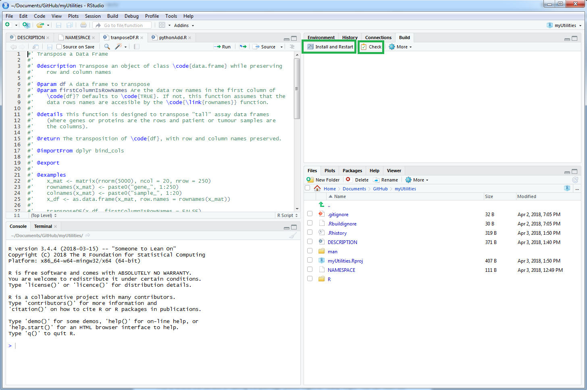

### "Install and Restart"
According to the RStudio [developer support page](https://support.rstudio.com/hc/en-us/articles/200486508-Building-Testing-and-Distributing-Packages), the "Install and Restart" button does [four things](https://support.rstudio.com/hc/en-us/articles/200486488-Developing-Packages-with-RStudio):

1. Unloads any existing version of the package (including shared libraries if necessary).
2. Builds and installs the package using `R CMD INSTALL` (the same thing that `devtools::install()` does).
3. Restarts the underlying R session to ensure a clean environment for re-loading the package.
4. Reloads the package in the new R session by executing the `library()` function.


### "Check"
The "Check" button checks the package using `R CMD check` (the same thing that `devtools::check()` does). Some ERRORs or WARNINGs can be rather cryptic, so it's easier to build and check your package after you finish each chunk of code in a single R file. That way, you know that any ERROR or WARNING that appears was caused by the last bit of work you did in one particular file. Also, the `check` function runs any examples you have in your function documentation (as well as any code you've put in the `test/` directory), so this is another helpful way to make sure that none of the incremental changes you make to your functions break any of the other code in your package. As an aside on my development habits, I will "Install and Restart" then "Check" the package I'm currently developing multiple times per day. Getting in this habit early will make life so much easier for you later on.


### Build options
You can pass options to these command-line functions through the "Build Tools" tab of the "Project Options" window. Access this via `Tools > Project Options > Build Tools` or in the "Build" tab via `More > Configure Build Tools... `

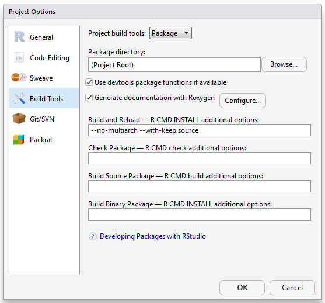

*******************************************************************************


</br>

# Optional: Share with GitHub
See [this excellent guide](http://kbroman.org/github_tutorial/) from Dr. Karl Broman. More on this to come later.