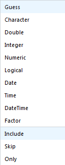

```{r setup, include=FALSE}
knitr::opts_chunk$set(echo = TRUE)
```


# Overview
In this lesson, we will recreate the "SNAP Usage by ZIP Code" graph from the very first lession. In order to do this, we will 

1. Start an `R` project
2. Import raw data
3. Clean the data
4. Advanced Topic: Join the response to spatial data
5. Plot the data

In case you don't remember, this is what our final project should look like:
```{r ZIP_choropleth, echo = FALSE, message = FALSE, warning = FALSE}
# This code requires the following data files. If you are unfamiliar with data
#   import, please skip.
load("../data/miamidade_broward_SNAP_percent_x_ZIP_df.rds")
load("../data/miami_map.rds")
# install.packages("ggmap")
# install.packages("viridis")
library(ggmap)
library(viridis)
ggmap(miami_ggmap) + 
  geom_polygon(aes(x = long, y = lat, group = group, fill = SNAP_Percent),
               size = 0.2, color = "black",
               data = sFL_SNAP_df) +
  ggtitle("Percent of Households Receiving SNAP Benefits by ZIP Code") +
  labs(x = "Longitude", y = "Latitude", fill = "SNAP Percent") +
  scale_fill_viridis(option = "magma")
```

</br>


# Create a New `R` Project
We have already discussed in some detail about how to create a new RStudio project, so I won't belabor the point too long. This material is covered in [Chapter 8](http://r4ds.had.co.nz/workflow-projects.html) of *R for Data Science*. Here is what the project directory looks like for these data science seminars:


The file `Miami QSC.Rproj` is the *RStudio Project File* associated with the work I have done for this seminar series. If I were to double-click on this file, RStudio would open with all of my files that I was working in when I last saved that project. When you use RStudio projects, you don't have to remember all the files you had in use and manually re-open them. I recommend that as soon as you have more that one script, you create an RStudio project to organize your files.

</br>

## Steps to Create a Project
So that you don't painfully lose your work every time you restart, RStudio offers built-in project creation. Once you have a directory with a few scripts, data files, output files, and / or graphs, create a project to hold it all.

1. Go to File \> New Project
2. Select the "Existing Directory" option  

3. In the "Project Working Directory", click 'Browse""and find the directory with your scripts and data files.  

4. Click "Create Project"

Now, any work you do in that project will be associated with your previous work. All your files stay nice and organized. You will use this project to store figures for your publications, as well as the scripts you used to create them. This means that the next time your pesky reviewer asks you to change a plot label, you don't have to deal with editing the .JPG or .PDF file---you can simply re-run the code to build a new picture! Your data files, analysis scripts, output `.csv` files, and publication graphics all stay together under the project banner.

</br>

## Add Raw Data Files to your Project
In order to plot food stamp usage by ZIP code, we first need data.

### Miami-Dade and Broward County ZIP Codes
All of the ZIP codes in [Broward](https://www.zip-codes.com/county/fl-broward.asp) and [Miami-Dade](https://www.zip-codes.com/county/fl-miami-dade.asp) are online in tables that look like this:


We are going to simply highlight all the data in the table, copy it, paste it into a basic text editor (like Notepad or TextEdit), and save it in our package directory. You will end up with a `.txt` file that should look like this:


Repeat this for Broward County.

### Food Stamps by ZIP Code
For data on households receiving Supplemental Nutrition Assistance Program (SNAP) benefits, we check with the [US Census Bureau](https://factfinder.census.gov/faces/tableservices/jsf/pages/productview.xhtml?pid=ACS_16_5YR_S2201&prodType=table). We download the data: "Download" \> "Use the Data" \> "OK" \> "Download" \> save the zipped folder in your project directory \> unzip the folder and delete the zipped original. You should have a metadata file called `ACS_16_5YR_S2201_metadata.csv` which explains all the variable names and a data file called `ACS_16_5YR_S2201_with_ann.csv` that contains all the features of interest. The first few rows and columns of the data file should look like this:


Notice that the `GEO.id2` column the ZIP codes.

</br>


# Import Raw Data
We finally have some raw data files on our working directory: two `.txt` files and one `.csv` file. While there are purely command-driven importing tools in R, we will discuss importing data with the RStudio (integrated development environment) IDE GUI first. In the top-right pane of the IDE, there is a menu of buttons to import different types of data.


Notice that we can import Excel, SAS, Stata, or SPSS data files, or we can import any text-based file with the `From Text (readr)...` button.

</br>

## The `readr` Package
The [`readr` package](https://cran.r-project.org/web/packages/readr/README.html) is the data import package of the [Tidyverse](https://www.tidyverse.org/). If you want a good overview of how to use this package, see the ["Getting Started"](http://r4ds.had.co.nz/data-import.html#getting-started) section of *R for Data Science* [Chapter 11](http://r4ds.had.co.nz/data-import.html). We'll load the `tidyverse` package suite now.
```{r load_tverse}
library(tidyverse)
```


### Package Goals
The `readr` pacakge has three main goals: 

1. Be faster than the `base::` package reading functions (`read.csv`, `read.delim`, `read.fwf`, etc.).
2. Import data as a [tibble](https://cran.r-project.org/web/packages/tibble/vignettes/tibble.html) (without getting hung up on character / factor conversion and without messing up row and column names).
3. Operate similarly on all operating systems.

### The Main Function(s)
There is one main file-reading function in the `readr` package, and two extensions of this function for commonly-occuring data formats (there are obviously more functions than just these three, but knowing how two of these three work will help you import the majority of data files you will see in practice).

1. `read_delim`: read any text-based delimited file into `R` as a tibble.
2. `read_csv`: an extension of `read_delim` designed to make reading `.csv` files easy.
2. `read_tsv`: an extension of `read_delim` designed to make reading tab-delimited `.txt` files easy.

Because these functions import data as a tibble ("table" + "data frame"), you should try to store data files such that each entry of a column is of the same "type" (all character, numeric, logical, etc.).

</br>

## Read a `.csv` File with `read_csv`
In the "Import Dataset" drop-down menu, select `From Text (readr)...`. In the "Import Text Data" pop-up window, click "Browse" to find and open your data. If you are using an RStudio project, then the "Browse" file finder should open directly to your package directory where you saved all three data files. Select the ACS data `.csv` file and click "Open". You should see this window:


There is a lot of stuff going on in this window! Let's unpack all of our options:

- The "Data Preview" pane shows you an Excel-style view of the first few rows and columns of your data:
    + The column names were imported correctly.
    + The `readr` package identifies the data type for each column by looking at the first 1000 rows.
    + The down-arrow next to the column name lets you manually override `readr`'s best guess for the column data type, as well as include, skip, or include only the column:
    
    
    
- The "Import Options" pane allows you more direct control over *how* the data file is imported:
    + "Name"--what name do you want to give the data tibble in the working directory? Often, the file itself has a long name, so it's better to name the tibble saved in your `R` environment a shorthand version.
    + "Skip"--skip reading the first rows of the file. This is helpful if you have metadata in the first few rows of the file, and the data itself doesn't start until later.
    + Check Box Options--these do what they say they do.
    + "Delimiter: Comma"--this drop-down menu allows you to switch among commas, tabs, semicolons, white space, or other delimiters. The `readr` package correctly identified that our `.csv` file was comma-delimited.
    + "NA"--how are missing values coded in your data? The drop-down menu has only a few options, but have more flexibility by interacting with the code itself (more on that next).
- The "Code Preview" pane shows you the results of all of the options you specified. Here is what the "Import Options" and "Code Preview" panes look like for the ACS SNAP `.csv` data:


The "Code Preview" pane shows what code will be ran automatically when I click the "Import" button in that window. Specifically, I've chosen to import the ZIP code column as a character column, I've named the incoming data object `FL_allZIPs`, and I've turned off the automatic `View()` command. Also, notice that because `readr` identified that the data file was a `.csv` file, the `read_csv()` function was selected automatically. We click "Import" and this code runs for us:
```{r read_SNAP_csv}
FL_allZIPs <- read_csv("../data/ACS_16_5YR_S2201_with_ann.csv", 
    col_types = cols(GEO.id2 = col_character()))
```

</br>

## Read a Tab-Delimited `.txt` File with `read_tsv`
Now that we have a decent idea of how the `read_csv` function works, we can easily read in the Miami-Dade and Broward ZIP code files with the `read_tsv` function---it has the same syntax!
```{r read_ZIPs_txt}
miamidade_ZIPs <- read_tsv("../data/miamidade_ZIPcodes.txt")
broward_ZIPs <- read_tsv("../data/broward_ZIPcodes.txt")
```

Notice the messages `readr` gives us when importing data: all the columns (except for population) were imported as character columns. For comparison, importing this data with the base `read.delim` and `read.csv` functions required me to spend time fixing the formatting of my data (I'll show an example next of what I had to do after importing these same data sets with the `base::` reading functions).

</br>


# Clean your Data
The first step of proper data cleaning is proper data importing. As I just mentioned, importing data with the `base::` package functions often requires additional code and effort. Here's an example of what some of my data cleaning would have looked like if I used the base functions instead:
```{r, eval = FALSE}
miamidade_ZIPs <- read.delim("../data/miamidade_ZIPcodes.txt")
miamidade_ZIPs$ZIP_Code <- as.character(miamidade_ZIPs$ZIP_Code)
miamidade_ZIPs$Population <- as.character(miamidade_ZIPs$Population)
miamidade_ZIPs$Population <- str_replace(miamidade_ZIPs$Population, ",", "")
miamidade_ZIPs$Population <- as.integer(miamidade_ZIPs$Population)
```
I would have to turn the ZIP codes from a factor to a character, but that's not so bad. Cleaning up the population column, however, is atrocious: factor to character to comma-less character to integer---not fun. The `read_tsv` function automatically knows that the numbers have commas in them, and removes them without incident.

</br>

## The `dplyr` Package
As we mentioned last session, the `dplyr` package has some very nice tools to help us manipulate data frames and tibbles. For review, here are the main `dplyr` functions:

- `filter()`: return rows that match a certain set of conditions
- `arrange()`: sort rows by a given set of measurements
- `select()`: select, rename, and / or reorder columns
- `mutate()`: create new columns (often as functions of your existing columns)
- `group_by()`: group rows by chosen columns
- `summarise()`: collapse multiple rows into one (often paired with `group_by()` for group summaries)

## Using `%>%` to Create a Pipeline
The "pipe" (`%>%`) operator in `dplyr` is very helpful for stringing together multiple data cleaning functions. Recall that the pipe operator takes the object on its left and inputs it as the first argument of the function on its right. For example
\[
f(x, y) \Longleftrightarrow x\ \text\ f(y).
\]

### Improving the `base::` Cleaning Script
If I had used a pipe operator and `dplyr` functions in the above data cleaning script, this is what that pipeline would have looked like:
```{r, eval = FALSE}
miamidade_ZIPs <- read.delim("../data/miamidade_ZIPcodes.txt") %>%
  mutate(ZIP_Code = as.character(ZIP_Code)) %>%
  mutate(Population = as.character(Population)) %>%
  mutate(Population = str_replace(Population, ",", "")) %>%
  mutate(Population = as.integer(Population))
```

Compare the two scripts: if you had to repeat the first script for the Broward county ZIP codes file, you would have to replace the `miamidade_ZIPs` object name 10 times! With the pipe operator, I only need to replace that name twice. This results in code that is much easier to reuse, share, and debug. It's worth noting, however, that because we imported our data with `read_tsv`, we don't need any of that code at all!

### Cleaning the `readr` Script `.txt` Files
Because we imported our ZIP code files with `readr`, there are only a few steps left to do. We need to

- Extract the ZIP code number from the `ZIP_Code` columns.
- Remove ZIP codes with no people.
- Remove unnecessary columns.

The first step will require a regular expression. If you don't know how to use these, don't worry. You can Google most of the regular expressions you will need. [This website](http://regexlib.com/Search.aspx?k=US%20ZIP%20codes) shows us some example patterns to search for ZIP codes in a character string. the second step will be a simple `filter` command, and the third step is a simple `select` command. Look how easy it is to apply the code to clean one data set to the other:
```{r clean_county_ZIPs}
miamidade_ZIPs_clean <- miamidade_ZIPs %>% 
  mutate(ZIP_Code = str_extract(ZIP_Code, "\\d{5}")) %>%
  filter(Population > 1) %>%
  select(ZIP_Code, Population) %>% 
  mutate(county = "Miami-Dade")

broward_ZIPs_clean <- broward_ZIPs %>% 
  mutate(ZIP_Code = str_extract(ZIP_Code, "\\d{5}")) %>%
  filter(Population > 1) %>%
  select(ZIP_Code, Population) %>% 
  mutate(county = "Broward")
```

### Cleaning the `.csv` File
THe US Census survey data has a lot of information we don't need. Specifically, we need to keep the `HC04_EST_VC01` (the proportion of households receiving SNAP benefits) and `GEO.id2` (the ZIP code) columns. Also, we need to transform the `HC04_EST_VC01` column from character to numeric, and change the name to something easier to understand.
```{r clean_SNAP}
FL_allZIPs_clean <- FL_allZIPs %>% 
  mutate(SNAP_Percent = as.numeric(HC04_EST_VC01)) %>% 
  rename(ZIP_Code = GEO.id2) %>% 
  select(ZIP_Code, SNAP_Percent)
```


## Join the Data
First, we want to join the two clean county data frames together. To do this, we use the `bind_rows` function.
```{r bind_counties}
sFL_ZIPs <- bind_rows(broward_ZIPs_clean, miamidade_ZIPs_clean)
```

Now we can join the SNAP data to the South Florida counties data. We will use the `left_join` function to match all the SNAP data to the Miami-Dade and Broward county ZIP codes. For information on the `*_join` functions, see the [`dplyr` cheat sheet](https://www.rstudio.com/wp-content/uploads/2015/02/data-wrangling-cheatsheet.pdf).
```{r join_ZIP_to_SNAP}
sFL_SNAP <- left_join(sFL_ZIPs, FL_allZIPs_clean, by = "ZIP_Code")
```

</br>


# Advanced: Join a Spatial Data Frame
**This section is quite advanced.** Don't feel discouraged if you can't understand it all at first.

## Download the Shapefiles
Basically, we want to find the [shapefile](https://en.wikipedia.org/wiki/Shapefile) associated with the South Florida ZIP codes. To do this, we will use the [`tigris` package](https://walkerke.github.io/2017/05/tigris-v05/) to find the "ZIP Code Tabulation Area" shapefiles for South Florida. If we don't specify the ZIP codes we want specifically, the `zctas` function will try to download *ALL* the US ZIP code shapefiles. Also, we can use the `tigris` options to "cache" the downloaded files (in case we accidentally run the command again).
```{r tigris, message = FALSE}
# The tigris package does not currently work for R devel (3.6)
# install.packages("sf")
# install.packages("tigris")
library(tigris)
options(tigris_use_cache = TRUE)
sFL_zcta <- zctas(cb = TRUE, starts_with = sFL_SNAP$ZIP_Code)
plot(sFL_zcta)
```


## Join the Data to the Shapefile
By itself, this map isn't terribly pretty, and it only has the ZIP code shapes themselves---nothing more. If we want to add on the SNAP usage, we need some way to join the `sFL_zcta` object to our `sFL_SNAP` tibble. Thankfully, the `tigris::` package has just the function for us:
```{r tigris_join}
sFL_joined_spdf <- geo_join(
  spatial_data = sFL_zcta,
  data_frame = sFL_SNAP,
  by_sp = "GEOID10",
  by_df = "ZIP_Code"
)
```

## Tidy the Spatial Data Frame
We have one last step before we can use `ggplot` to make a prettier map. We need to "sweep" the extra column information into rows (to make the spatial data frame tidy). This step can be very difficult. I will step into an older `tidyverse` package for help:
```{r broom, warning=FALSE}
library(broom)
# Extract the shapefile as a data frame
sFL_poly_df <- tidy(sFL_joined_spdf)
# Extract the SNAP data
sFL_SNAP_wID <- sFL_joined_spdf@data
sFL_SNAP_wID$id <- sapply(sFL_joined_spdf@polygons, function(x){
  slot(x, "ID")
})
# Join the tidy polygon data to the SNAP response
sFL_SNAP_df <- right_join(sFL_poly_df, sFL_SNAP_wID, by = "id")
```

</br>


# Plot South Florida with `ggmap`
Finally, we are ready to plot this data. We first download the map of the Miami Metroplex. We also load a helper package for better colors.

EDIT: The fascists at Google now require an API key, so we are skipping this section.
```{r miami_metro, message = FALSE, error=TRUE}
library(ggmap)
library(viridis)
miami_ggmap <- get_map(location = "Miami, FL", zoom = 9, source = "stamen")
ggmap(miami_ggmap)
```

Now, we add the per-ZIP-code SNAP proportion to the map of the Miami Metro Area. This is the same image we started with.
```{r ggmap_SNAP, eval=FALSE}
ggmap(miami_ggmap) + 
  geom_polygon(aes(x = long, y = lat, group = group, fill = SNAP_Percent),
               size = 0.2, color = "black",
               data = sFL_SNAP_df) +
  ggtitle("Percent of Households Receiving SNAP Benefits by ZIP Code") +
  labs(x = "Longitude", y = "Latitude", fill = "SNAP Percent") +
  scale_fill_viridis(option = "magma")
```