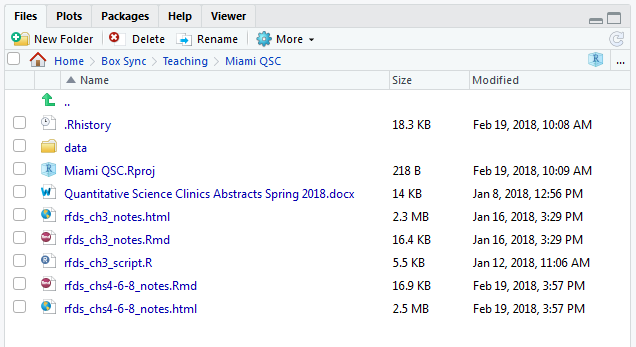
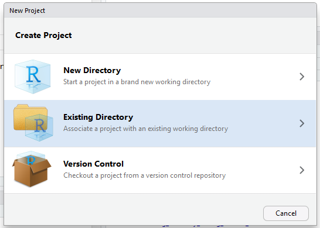

```{r setup, include=FALSE}
knitr::opts_chunk$set(echo = TRUE, prompt = TRUE)
options(prompt = '> ')
```

# Overview
In this lesson, we will treat the data analysis process like writing an essay. An essay is often a written work describing or defending one particular point of the author. Essays are composed of paragraphs. A paragraph discusses a single part of the essay's whole topic. Paragraphs are short collections of sentences, all in regard to the single point of the paragraph. Sentences are the building blocks of essay argumentation or description. Sentences are often built of subjects, verbs, and objects. People often use a text editor, like Microsoft Word or LaTeX, to write, format, and edit essays.

A code project is written work of computer code and paired descriptions completing one particular goal of the author. Projects are composed of code scripts. A code scipt implements a single part of the project's whole goal. Scripts are short collections of commands and comments, all in regard to the single purpose of the script. Code commands are the building blocks of project execution. Code commands are often built of inputs, functions, and outputs. People often use an IDE (integrated development environment), like [RStudio](https://www.rstudio.com/) or [jupyter](http://jupyter.org/), to write, format, and execute code.

Writing                                Coding
----------------------------------     -----------------------------------
MS Word                                RStudio
Essay                                  Project
Paragraph                              Script
Sentence                               Command
Subjects, Verbs, and Objects           Inputs, Functions, and Outputs


<br>

# Introducing `R` Code: The Code "Sentence"
We first discuss the building blocks of `R` code: objects, functions, and outputs. Remember, just like in proper English sentences, words have spaces between them. *Youwouldn'twriteasentencelikethis*, so don't write your code like that either! Use spaces!


## Everything is an Object
For the computer programmers out there, `R` is neither a purely "object-oriented" (OOP) language nor a purely "functional" (FP) language, but shows behaviour from both schools. For everyone else who either doesn't know or doesn't care about the OOP v FP distinction, this is the last we'll talk about it. Remember this, however, **everything in `R` is an object.** 

<br>

### Our First Object
If you want to create a new object in `R`, we use the assignment operator:
```{r first_assignment}
myMessage_char <- "Hello World"
myMessage_char
```
We created an object, and then printed the contents of that object. Let's now look in detail at this process. I'm going to create an object to hold my current age.

```{r second_assignment}
myAge_num <- 29
```

We have followed the traditional form of the *assignment* statement. These are our very first code "sentences": the subjects are the character "Hello World" and number 29, the verb is the assignment operator (`<-`), and the objects are these `myMessage_char` and `myAge_num` thingies. We read the second code sentence as "the `myAge_num` object contains the number 29". `myAge_int` is an *object*. Objects have names and values: the name of this object is `myAge_num`, and it's value is the number 29. The name of our first object is `myMessage_char` and its value is the character string "Hello World".

<br>

### Object Names
As Shakespeare famously penned,

> What’s in a name? That which we call a rose  
> By any other word would smell as sweet.  
> *Romeo and Juliet*, Act 2, Scene 2

Unfortunately for us, computer programmers were never very good at Shakespeare, so names are *very* important in writing good code. Look back to our two examples. Our objects are named `myMessage_char` and `myAge_num`. If you are reading my code, could you guess what those two things are? My age and my message, right? What about if we had named the objects `Stuff`, `stuff`, `x`, `x1`, `morestuff`, `X`, or `omgNeedCoffee`? Notice that **cAsE MaTtErS**. Use names that are short, but descriptive. There are a few conventions for naming things:
```{r names, eval=FALSE, prompt=FALSE}
snake_case
camelCase
period.case
aBsoLUTE.andCOMPLETE_utternonsense
```

Notice another thing about my object names: they all end with a brief tag explaining *what type of object they are*. `myMessage_char` is a character string, while `myAge_num` is a number (numeric, technically). I recommend using `camelCase` followed by an abbreviation for the type of the object, but you can pick whatever convention you like (but please be consistent).

<br>

### Basic Object Types
`R` has a bazillion different types (or "classes") of objects, by they are usually variants of a few basic classes: vectors, matrices, data frames, lists, and functions. That's right---in `R`, even the "verbs" are technically still objects. In the next section on functions, we will see how to create different types of objects, using the predefined object creation functions. One key point: **most object classes can be boiled down to two types of things**:

  - *atomics*: each element must have the same class (vectors and matrices). Common atomic classes are (in order of complexity)
    + Logical: `TRUE` or `FALSE`
    + Integer: `1L`, `2L`, ...
    + Numeric: `1`, `2.3`, `pi`
    + Character: `"Hello World"`, `"1428 Elm Street"`
  - *lists*: each element can have a different class (lists and almost everything else).


<br>

## Functions: The Code "Verbs"
Functions are the action words of `R` coding, and they are very flexible and powerful. Functions take in an object, and return another object (even if that object is empty). Remember, **everything you *do* in `R` calls a function.** We've already seen a special function: the `<-` (assignment) operator. This function took in our values, and assigned them to objects.

### Basic Function Syntax
Most `R` functions look like this: `functionName(argument1 = value1, argument2 = value2, ...)`. This function is an object called `functionName`. We don't know what it does, because the operations of the function are stored within the object `functionName`. We do know that it takes in two arguments with two values, and does something to them. Let's use a function to create our first matrix.
```{r first_matrix}
myData_mat <- matrix(data = 0, nrow = 5, ncol = 2)
myData_mat
```

Notice a few things. We used a function called `matrix` with three arguments (`data`, `nrow`, and `ncol`). This function did some things behind the scenes (as defined in the object `matrix`), and returned an output. This output is a matrix of zeroes with two columns and five rows. The `data` input was recycled to fill the entire matrix.

<br>

### Our First Function
Because we know that functions are also objects, we can create them just like anything else: with a creation function. Function creation has the following syntax:
```{r function_syntax, eval=FALSE, prompt=FALSE}
myFun_fun <- function(argument1){
  
  body
  
}
```
We can use this syntax to create a function to add two numbers (obviously this function already exists, but bear with me).
```{r our_addition_function}
mySum_fun <- function(x, y){ x + y }
mySum_fun(2, 3)
```
We can create many of our own functions, and use these functions to accomplish very difficult tasks. This flexibility to create any function we can think of is one of `R`'s greatest strengths, but also part of what gives `R` its distinct learning curve.

<br>

### Creating Atomic Objects
We can create vectors similarly to matrices, but we use the function `c` (it's short for "concatenate"). We can use `L` after the numbers to tell `R` we specifically want integer ages.
```{r first_vector}
siblingsAge_int <- c(28L, 26L, 24L, 22L, 20L)
```

Let's use another function to look inside an object. The `str` function returns the *structure* of the object passed to it.
```{r str_func}
str(myData_mat)
str(siblingsAge_int)
```
As we can see, our data matrix is a *numeric* matrix of zeroes with five rows and two columns, and our vector is an *integer* vector with five ages.

What if we wanted to create a data vector for each of my siblings? Let's create this vector, and then look inside it.
```{r person_vec}
hannah_info <- c(firstName = "Hannah", heightMetres = 1.651, age = 20L, Female = TRUE)
str(hannah_info)
```
What happened? We see that all of the entries in our vector have been turned into character strings! Remember that vectors and matrices are *atomic*? That means they can only hold one class of thing at a time. Because the vector had a character, numeric, integer, and logical entry, `R` chooses the most complex atomic type (character in this case), and *promotes* each vector entry to the mose complex type. `R` does this so that you never lose information---`R` only transforms it. Also, we first see that each element of the vector has a name, stored in the `attr` field (short for *attribute*). 

<br>

### Creating Non-Atomic Objects
We quickly decide that we need a better way to store Hannah's information. We can use a list instead. *A list is a vector with the atomic type restriction removed.* Let's store Hannah's information as a list instead.
```{r person_list}
hannah_ls <- list(firstName = "Hannah", heightMetres = 1.651, age = 20L, Female = TRUE)
str(hannah_ls)
```
Now we have all our information in the atomic type we want. What if we want to add all her favourite desserts to this list? We can do that too.
```{r person_list2}
hannah_ls$favDesserts <- c("Boston Cream Pie", "Strawberry Shortcake", "Bacon")
str(hannah_ls)
```
Lists can contain anything they need to, even other lists! This is particularly useful when dealing with patient or sample records, as one list element can be a longitudinal regression response vector, another element the predictor matrix, and another the unique subject identifier.

We can similarly create a data frame to store all the siblings names and ages. *A data frame is a matrix with the atomic type restriction removed across columns (but not rows).* (Technically speaking, data frames are lists with an added dimension attribute, but we can talk more about that another time. Think of them as an Excel table for now.)
```{r person_df}
siblingsAge_df <- data.frame(Names = c("Britni", "Michael", "Christiana", "Oliva", "Hannah"),
                             Age = siblingsAge_int,
                             stringsAsFactors = FALSE)
siblingsAge_df
str(siblingsAge_df)
```
Notice that this object prints like a matrix, but allows for different object types in each column (so long as each column is the same length). Also notice that we used a pre-defined object (`siblingsAge_int`) as one of our columns. The `Names` column has class character (`chr`) amd the `Age` column has class integer (`int`). Data frames are often the "go-to" data structure in `R`, because of their flexibility and organization.


<br>

# Writing Code Scripts: The Code "Paragraph"
Just like we use a word processor when writing an essay, we use an IDE when writing code. Here is the layout of the RStudio IDE.


So far, all of the code we have typed has been in the Console (bottom left) after the code "prompt" (`>`). This is fine for writing a "sentence" or two at a time, but "paragraphs" should be written in the Editor (top left). In `R`, it is often very difficult to go back and edit your code once you execute it in the Console. If you write a script ("paragraph") in the Editor, however, you can make as many edits as you need, all while keeping a record of your steps. Let's start a new script:

1. Go to File \> New File \> R Script
2. Type "Hello from my first Script!"
3. With your cursor on the line you typed, press CTRL + ENTER to *run* your code.

You will notice that `"Hello from my first Script!"` appeared in the Console below, and your cursor moved to a new line in your script. You can write new commands and run them, or you can move your cursor back up to the previous line to edit the code that you've written.


## Code "Paragraph" Rules
Just like written paragraphs in English have certain rules, code scripts also have rules and best practices to help keep your work organized. Let's consider an example data analysis for argument's sake. We need to import the data, clean it, wrangle it (more on this next class), analyze it, and graph the results.

1. All the code in one script should be related to **one** subtopic of your analysis. For instance, in the data analysis example above, we would create a seperate script for data import and cleaning, a script for wrangling and transformation, an analysis script, and a graphics script.
2. Scripts should be named (and often dated) based on what part of the workflow they handle. For example, the analysis script may be called `breast_cancer_2017June_data_analysis.R`.
3. Lines in your script should be at or fewer than 80 characters wide whenever possible. If this is not possible, then think of this as an opportunity to write a function to make your code cleaner. You can use the "Code GPS" on the bottom left of the Editor pane to tell you where in the script you are. In our current script, the "!" character is the 28th character in the first line, so the code GPS shows "1:28". Why 80 characters per line? Because we are [slaves](https://softwareengineering.stackexchange.com/questions/148677/why-is-80-characters-the-standard-limit-for-code-width) to [tradition](http://www.columbia.edu/cu/computinghistory/census-tabulator.html).
4. Non-trivial code should be annotated with helpful or clarifying comments. Use the `#` (pound sign, or hashtag, depending on your age) to comment a single line of code in `R`. When you add comments to your code, try as much as possible to answer *why* you wrote the code that you did and the way you did, rather than simply parroting *what* your line of code does.
5. Partition chunks, or blocks, of code with six pound signs on either side of a block title. This helps to keep your thoughts organized. Many times I will see that a code block has become very large, which prompts me that it should be it's own script. In the RStudio IDE, when you name a code block, the name of that block will appear in the bottom left of the Editor pane, right next to the code GPS. If you haven't organized your script into chunks yet, you should see `(Top Level)` or `Untitled` in this space.


<br>

## Example Script
```{r python_plus_operator, prompt = FALSE}
######  Overview: Create Python `+` Function in R  ############################
# In Python, the `+` operator can be used to concatenate strings, as well as
#   perform any regular addition operations as needed. We will create a variant
#   of this function in R.


######  Define the Function  ##################################################

`%++%` <- function(a, b){
  
  if(!(is.atomic(a) && is.atomic(b))){
    
    # The `+` function won't work for lists anyway
    stop("Error: non-atomic argument to atomic operator")
    
  } else {
    
    # If we aren't dealing with lists, then we have four possible cases:
    #   both characters, one is a character but the other isn't, or neither are
    #   characters. We will use the paste0() function to paste characters
    if(is.character(a) && is.character(b)){
      out <- paste0(a, b)
    } else if(is.character(a) && !is.character(b)){
      out <- paste0(a, as.character(b))
    } else if(!is.character(a) && is.character(b)){
      out <- paste0(as.character(a), b)
    } else {
      out <- a + b
    }
    
  }
  
  return(out)
  
}

#####  Test the Function  #####################################################
```

```{r test_python_plus, error = TRUE}
1 %++% 2

myData_mat %++% 2 * (myData_mat + 1)

"a" %++% "bc"

"a" %++% 2
3 %++% "bc"

"a" %++% hannah_ls
```

<br>

## Analyze the Example
Let's unpack this script (but don't worry if you don't understand all the code).

  - The entire script is dedicated to one idea: to replicate the Python `+` operator (which can concatenate strings). There are no lines of code that don't belong.
  - When I save this script, I will name it something informative, like `utility_func_python_plus_op.R`, that way I will be able to organize my script files later without having to open each one.
  - All of my lines are 80 or fewer characters wide. This makes the function and comments easy to read through. 
  - I've added some helpful comments in the `if else` control flow, so that other people can make some sense of what is going on. Also, my script has an overview statement, where I explain *why* I'm doing what I'm doing. 
  - My script is broken up into three sections: introduction, the function definition, and function testing. At the bottom of the Editor pane, I can click on the block name I want to quickly navigate through my script to that section.


<br>

# Organizing Code Scripts with Projects: The Code "Essay"
We have written quite a few code sentences, and we have organized these code sentences in to code paragraphs (scripts). It's time to create our code essay (project). Projects are the collection of script and data files that are necessary for, or the output of, an analysis workflow. Here is what the project directory looks like for these data science seminars:


The file `Miami QSC.Rproj` is the *RStudio Project File* associated with the work I have done for this seminar series. If I were to double-click on this file, RStudio would open with all of my files that I was working in when I last saved that project. When you use RStudio projects, you don't have to remember all the files you had in use and manually re-open them. I recommend that as soon as you have more that one script (or a single long script that you *really* should have broken into a few different scripts already---jeez), you create an RStudio project to organize your files.

<br>

## DO NOT: Save your workspace
Get in the habit of starting the day's work with a fresh environment. This will reduce the "it worked on my machine" errors considerably. You want to periodically restart `R` and re-run your scripts to ensure that the code results you are seeing aren't the result of some hidden artefact or forgotten object definition. I restart my `R` session and re-run my scripts around once per hour or so. To quote the masters,

> With your R scripts (and your data files), you can recreate the environment. It’s much harder to recreate your R scripts from your environment! You’ll either have to retype a lot of code from memory (making mistakes all the way) or you’ll have to carefully mine your R history.  
> Wickam and Grolemund, *R for Data Science*  

To this end, I *strongly* recommend you remove the "restore workspace" option in RStudio.
{width=60%}

The keyboard shortcut for "restart and rerun" is CTRL + SHIFT + F10 (restart) then CTRL + SHIFT + S (source the current script). On a Mac, replace CTRL with CMD for the same effect.

<br>

## DO: Create a Project
So that you don't painfully lose your work every time you restart, RStudio offers built-in project creation. Once you have a directory with a few scripts, data files, output files, and / or graphs, create a project to hold it all.

1. Go to File \> New Project
2. Select the "Existing Directory" option  

3. In the "Project Working Directory", click 'Browse""and find the directory with your scripts and data files.  

4. Click "Create Project"

Now, any work you do in that project will be associated with your previous work. All your files stay nice and organized. You will use this project to store figures for your publications, as well as the scripts you used to create them. This means that the next time your pesky reviewer asks you to change a plot label, you don't have to deal with editing the .JPG or .PDF file---you can simply re-run the code to build a new picture! Your data files, analysis scripts, output .csv's, and publication graphics all stay together under the project banner.


<br>

# Your Turn
Take all of the code, output, data, and graphics files from one of your small projects, move it into one directory, and create a RStudio project for that directory.
